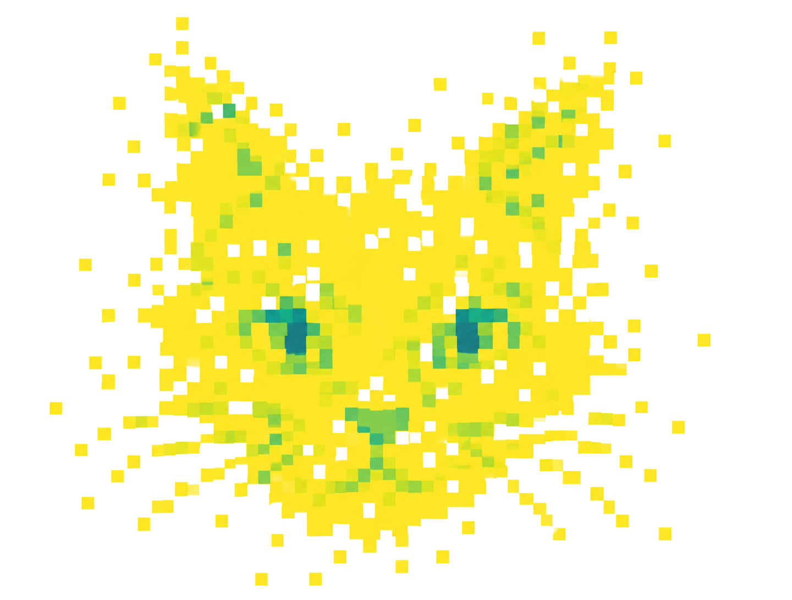

<p align="center">
  
</p>

# copu_cat

Match simulated (injected) galactic binaries to the sources recovered by a LISA global fit, without
knowing in advance which is which, and measure the **purity** and **completeness** of the catalog.
**Based on [project_catalog](https://github.com/jkanner/project-catalog)**

For every recovered source (a posterior from the global fit) and every injection close to it in
frequency, copu_cat computes where the injection falls inside the posterior (highest-density-region
level, "HDR", in 1D and 6D/8D). An injection *matches* a posterior when it lies inside its credible
region. A one-to-one assignment then pairs each posterior with at most one injection, either
greedily by SNR or by the lowest total 6D HDR (user's choice).

## Installation

Requires Python ≥ 3.13 and [uv](https://docs.astral.sh/uv/).

```bash
git clone https://github.com/dpcatch/copu_cat.git
cd copu_cat
uv sync                 # creates .venv with all dependencies, including the global-fit packages
source .venv/bin/activate
```

The global-fit packages (`lisa-global-fit`, `backgrounds`, and `lisa-gf-noise`, which comes with
`lisa-global-fit`) are installed from GitLab.

### Erebor noise model: compilers and libraries

The Erebor noise model (`lisa-gf-noise[erebor]`, used only for `copu-cat-snr --noise-model erebor`)
is an optional extra: install it with `uv sync --extra erebor` (a plain `uv sync` leaves it out, and
removes it if it was installed). It pulls in `gpubackendtools` and `lisaanalysistools`, which are
compiled from source (C++, Fortran, LAPACKE). On macOS, install the tools once:

```bash
brew install gcc lapack pkgconf     # gcc provides gfortran; lapack provides LAPACKE
```

and set these in the shell **before** `uv sync --extra erebor` (or add them to `~/.zshrc`):

```bash
export FC=$(brew --prefix)/bin/gfortran
export PKG_CONFIG_PATH="$(brew --prefix lapack)/lib/pkgconfig:$PKG_CONFIG_PATH"   # lapack is keg-only
```

They are only needed when uv actually builds these two packages: the first install, a new version,
or after clearing the uv cache (`uv cache clean`). Otherwise uv reuses the built wheels. Without
them the build stops with `No CMAKE_Fortran_COMPILER could be found` or
`LAPACKE support is required but could not be satisfied`.

If the final link complains about missing `_gfortran_*` symbols, also set
`export CMAKE_ARGS="-DGBT_LAPACKE_EXTRA_LIBS=gfortran"` (not needed so far).

Dependency overrides in `pyproject.toml` (`[tool.uv] override-dependencies`), with the reasons in
comments there:

- `lisaanalysistools` v1.2.8.post3 instead of the post1 pinned by `lisa-gf-noise[erebor]`: post1
  cannot read the metadata of Erebor v4 runs.
- `eryn` from Erebor's fork for everything (`lisa-global-fit` would take it from PyPI).
- `gbgpu` (PyPI wheel) is a direct dependency: `lisatools.globalfit.postprocessing` imports it but
  `lisaanalysistools` does not declare it (`ModuleNotFoundError: No module named 'gbgpu'`).
- `mojito-processor>=0.6.3` from PyPI: `lisaanalysistools` points it at TestPyPI, which only has
  old versions, and `uv lock` fails with no solution or with conflicting indexes.

Check that the Erebor noise model is available:

```bash
python -c "from lisa_gf_noise import EREBOR_AVAILABLE; print(EREBOR_AVAILABLE)"   # True
```

## Inputs

1. **Injection catalog**: a pandas HDF5 table (key `cat`) in global-fit catalog format, with columns
   `Frequency, Amplitude, FrequencyDerivative, RightAscension, Declination, Inclination,
   Polarization, InitialPhase, snr, ID`, e.g. `gb_catalog.h5`.
2. **Posterior samples**: a `.npy` array of shape `(n_sources, n_samples, 8)`, e.g. `all_gb_samples.npy`.
   The order of the last axis is set with `--param-order` (default:
   `Frequency, Frequency Derivative, Dec, RA, Amplitude, Inclination, Polarization, Initial Phase`).
3. For the catalog SNR (optional): the global-fit noise posterior, `noise_samples_0.h5`, copied into the data directory.

All outputs go to one **data directory**: `./data` by default, or `$COPU_CAT_DATA_DIR`, or
`--data-dir` on any command. Its layout is described in `copu_cat/config.py`.

## Pipeline

Each step is an installed command; `python scripts/<name>.py` does the same.

| step | command | script | output (in the data directory) |
|---|---|---|---|
| 1 | `copu-cat-convert-injections gb_catalog.h5` | `scripts/convert_injections.py` | `injection_set/injections.feather` |
| 2 | `copu-cat-convert-posteriors all_gb_samples.npy` | `scripts/convert_posteriors.py` | `posterior_chains/GF_<i>_posterior.feather` |
| 2 (Erebor) | `copu-cat-convert-erebor-posteriors <erebor_submission_dir>` | `scripts/convert_erebor_posteriors.py` | `posterior_chains/GF_<i>_posterior.feather` |
| 3 | `copu-cat-find-candidates` | `scripts/find_candidates.py` | `injection_matches/`, `candidate_counts.csv` |
| 4 | `copu-cat-hdrs` | `scripts/hdrs.py` | `hdrs/hdrs_<Name>.feather` |
| 5 | `copu-cat-combine-hdrs` | `scripts/combine_hdrs.py` | `hdrs.feather` |
| 6 | `copu-cat-snr posteriors --catalog gb_catalog.h5 --n-samples 20` | `scripts/snr.py` | `posterior_snr.csv` (optional) |

Notes:

- **Step 2** depends on the global fit: use `copu-cat-convert-posteriors` for a `.npy` of samples
  (e.g. geemoo) or `copu-cat-convert-erebor-posteriors` for an Erebor submission folder (its
  `*_GB.h5` detection table and `*_GB_posteriordir/`). Both write the same format;
  `posterior_index.csv` also keeps Erebor's `source_id`, sample count and detection statistic.
- **Step 4** is the slow one. It can be resumed (existing files are skipped) and split into
  independent ranges that run in parallel, e.g. `copu-cat-hdrs --start 0 --stop 1000`.
  It computes the 1D and 6D HDRs; the 8D HDR (a second flow fit per source, not used by the
  notebooks) only with `--with-8d`, otherwise its column is NaN.
  Step 5 can be run at any time for a preview.
  On a Slurm cluster, `slurm/hdrs.sbatch` runs it as a job array (submission command in the
  script). It needs only `posterior_chains/` and `injection_matches/` from the data directory, and
  a plain `uv sync` (no Erebor extra, so nothing to compile).
- **Step 6** computes the SNR of each recovered source with the global-fit waveform and noise model.
  It is needed for the greedy max-SNR assignment and for binning purity in catalog SNR.
  `copu-cat-snr injections --catalog gb_catalog.h5` recomputes the injection SNRs as a check
  against the catalog's own `snr`.
  For an Erebor run, add `--noise-model erebor --erebor-run <submission_dir> --erebor-orbits
  <any Mojito L1 file>`: the noise PSD then comes from the run's noise posterior and the Erebor noise
  model, and the observation window from the run's GB waveform model.

Then run the notebooks, in order:

1. `notebooks/match_injections_with_hdrs.ipynb`: matching, one-to-one assignment, match-status plots, purity and completeness.
2. `notebooks/ambiguous_matches.ipynb`: corner plots of injections matched to several posteriors and of posteriors matched to several injections.

Set `DATA_DIR` and `PLOTS_DIR` in the first code cell of each notebook.
